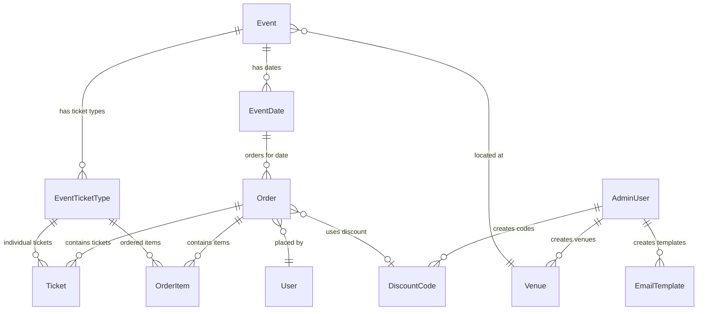
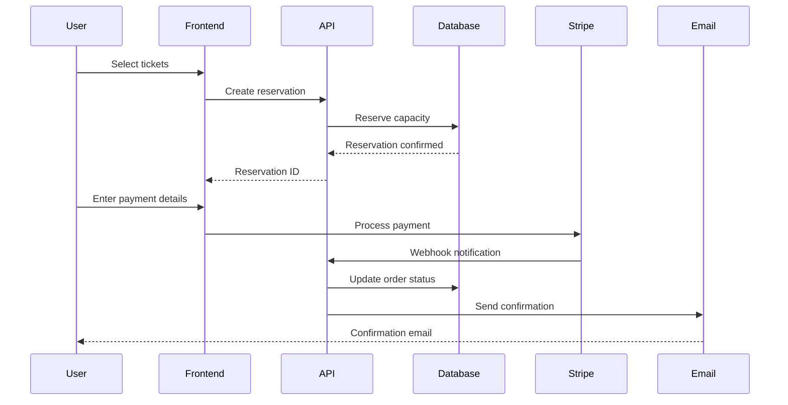
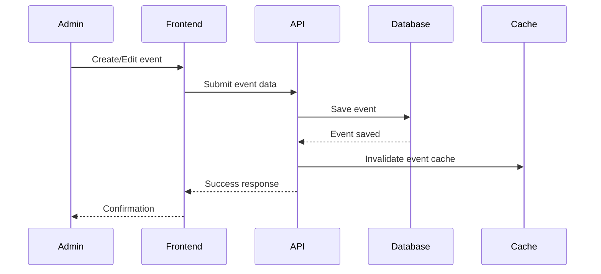

# 🏗️ JVS Tessera - System Architecture

## 📋 **Overview**

JVS Tessera is a modern, production-ready event ticketing system built specifically for the Jewish Vegetarian Society. The system follows a hybrid Next.js architecture combining App Router for modern pages and Pages Router for API routes, providing optimal performance and developer experience.

## 🎯 **Architecture Principles**

### **Core Principles**
- **Type Safety First**: Full TypeScript coverage with strict mode
- **Performance Optimized**: Server-side rendering, image optimization, caching
- **Accessibility Compliant**: WCAG 2.1 AA standards throughout
- **Mobile First**: Responsive design for all screen sizes
- **Security Focused**: Input validation, SQL injection protection, PCI compliance

### **Design Patterns**
- **Component Composition**: Reusable UI components with clear interfaces
- **Server-Side Validation**: All user inputs validated on the server
- **Atomic Operations**: Database operations prevent race conditions
- **Graceful Degradation**: System works even when external services fail

## 🏢 **System Architecture**

```mermaid
graph TB
    subgraph "Frontend Layer"
        UI[React Components]
        Forms[React Hook Form + Zod]
        State[Redux Toolkit]
        Routing[Next.js Router]
    end
    
    subgraph "API Layer"
        Public[Public APIs]
        Admin[Admin APIs]
        Auth[Authentication]
        Webhook[Stripe Webhooks]
    end
    
    subgraph "Business Logic"
        Events[Event Management]
        Tickets[Ticket System]
        Orders[Order Processing]
        Email[Email Service]
        Payment[Payment Processing]
    end
    
    subgraph "Data Layer"
        DB[(PostgreSQL)]
        Prisma[Prisma ORM]
        Cache[Next.js Cache]
        Files[Vercel Blob]
    end
    
    subgraph "External Services"
        Stripe[Stripe API]
        SMTP[Email Provider]
        Vercel[Vercel Platform]
    end
    
    UI --> API
    Forms --> API
    State --> UI
    Routing --> UI
    
    Public --> Business
    Admin --> Business
    Auth --> Admin
    Webhook --> Business
    
    Events --> Data
    Tickets --> Data
    Orders --> Data
    Email --> Data
    Payment --> Stripe
    
    Prisma --> DB
    Cache --> DB
    Files --> Vercel
    Email --> SMTP
```



## 🗂️ **Directory Structure**

```
tessera-main/
├── 📁 src/
│   ├── 📁 components/          # React components
│   │   ├── 📁 admin/          # Admin-specific components
│   │   ├── 📁 booking/        # Booking flow components
│   │   ├── 📁 ui/             # Reusable UI components
│   │   └── 📁 layout/         # Layout components
│   ├── 📁 pages/              # Pages Router (API + some pages)
│   │   ├── 📁 api/            # API endpoints
│   │   │   ├── 📁 admin/      # Admin API routes
│   │   │   ├── 📁 public/     # Public API routes
│   │   │   └── 📁 webhook/    # Webhook handlers
│   │   └── 📁 admin/          # Admin pages
│   ├── 📁 app/                # App Router (modern pages)
│   ├── 📁 lib/                # Utility functions and services
│   │   ├── 📁 services/       # Business logic services
│   │   └── 📁 utils/          # Helper utilities
│   ├── 📁 store/              # Redux store and slices
│   ├── 📁 constants/          # Application constants
│   └── 📁 ui/                 # UI component library
├── 📁 prisma/                 # Database schema and migrations
├── 📁 scripts/                # Utility scripts and seeding
├── 📁 public/                 # Static assets
└── 📁 docs/                   # Documentation
```

## 🔧 **Technology Stack**

### **Frontend Technologies**
| Technology | Version | Purpose | Status |
|------------|---------|---------|--------|
| **Next.js** | 13+ | React framework | ✅ Production |
| **React** | 18+ | UI library | ✅ Production |
| **TypeScript** | 5.0+ | Type safety | ✅ Production |
| **Tailwind CSS** | 3.0+ | Styling | ✅ Production |
| **HeadlessUI** | 1.7+ | Accessible components | ✅ Production |
| **React Hook Form** | 7.0+ | Form handling | ✅ Production |
| **Zod** | 3.0+ | Schema validation | ✅ Production |
| **Redux Toolkit** | 1.8+ | State management | ✅ Production |
| **Framer Motion** | 6.0+ | Animations | ✅ Production |

### **Backend Technologies**
| Technology | Version | Purpose | Status |
|------------|---------|---------|--------|
| **Next.js API Routes** | 13+ | API endpoints | ✅ Production |
| **Prisma** | 6.0+ | Database ORM | ✅ Production |
| **PostgreSQL** | 14+ | Database | ✅ Production |
| **Stripe API** | Latest | Payment processing | ✅ Production |
| **Nodemailer** | 6.0+ | Email delivery | ✅ Production |
| **bcryptjs** | 2.4+ | Password hashing | ✅ Production |

### **Infrastructure**
| Service | Purpose | Status |
|---------|---------|--------|
| **Vercel** | Hosting & deployment | ✅ Production |
| **Vercel Blob** | File storage | ✅ Production |
| **Neon/Railway** | PostgreSQL hosting | ✅ Production |
| **Stripe** | Payment processing | ✅ Production |
| **SendGrid/SMTP** | Email delivery | ✅ Production |

## 🗄️ **Database Architecture**

### **Core Data Models**

#### **Event System**
```typescript
Event {
  id: number
  title: string
  slug: string (unique, SEO-friendly)
  description?: string
  bespokeMessage?: string (custom email content)
  seatType: "free" | "seatmap"
  venueId?: number
  isActive: boolean
  
  // Relationships
  venue?: Venue
  dates: EventDate[]
  ticketTypes: EventTicketType[]
  categories: CategoriesOnEvents[] (legacy)
}
```

#### **Modern Ticket System**
```typescript
EventTicketType {
  id: number
  eventId: number
  name: string
  description?: string
  price: number (in pence)
  currency: string
  capacity?: number
  sold: number (denormalized counter)
  isActive: boolean
  sortOrder: number
  colorHex?: string
  isPublic: boolean
  
  // Relationships
  event: Event
  tickets: Ticket[]
  orderItems: OrderItem[]
}
```

#### **Order System**
```typescript
Order {
  id: string (UUID)
  userId: string
  eventDateId: number
  status: "PENDING" | "PAID" | "CANCELLED" | "REFUNDED"
  paymentType: string
  paymentIntent?: string
  discountCodeId?: string
  discountAmount: number
  originalTotal?: number
  finalTotal?: number
  
  // Relationships
  user: User
  eventDate: EventDate
  tickets: Ticket[]
  orderItems: OrderItem[]
  discountCode?: DiscountCode
}
```

### **Database Relationships**



## 🔐 **Security Architecture**

### **Authentication & Authorization**
- **Admin Authentication**: NextAuth.js with secure session management
- **Permission System**: Granular role-based access control
- **API Protection**: All admin endpoints require authentication
- **CSRF Protection**: Built-in Next.js CSRF protection

### **Data Security**
- **Input Validation**: Zod schemas validate all inputs
- **SQL Injection Protection**: Prisma ORM with parameterized queries
- **XSS Prevention**: React's built-in XSS protection
- **Password Security**: bcrypt hashing with salt rounds

### **Payment Security**
- **PCI DSS Compliance**: Stripe handles all card data
- **Webhook Verification**: Stripe webhook signature validation
- **Secure Tokens**: Environment-based secret management
- **HTTPS Enforcement**: All traffic encrypted in production

## 📡 **API Architecture**

### **Public APIs** (No Authentication)
```typescript
GET /api/public/events
// Returns: Event[] with availability data
// Rate Limited: 60 requests/minute

GET /api/events
// Legacy endpoint, returns basic event data
// Used by: Main JVS website integration
```

### **Admin APIs** (Authentication Required)
```typescript
// Event Management
GET    /api/admin/events
POST   /api/admin/events
PUT    /api/admin/events/[id]
DELETE /api/admin/events/[id]

// Ticket Type Management
GET    /api/admin/events/[eventId]/ticket-types
POST   /api/admin/events/[eventId]/ticket-types
PUT    /api/admin/events/[eventId]/ticket-types/[id]
DELETE /api/admin/events/[eventId]/ticket-types/[id]

// Order Management
GET    /api/admin/orders
POST   /api/admin/orders
PUT    /api/admin/orders/[id]
POST   /api/admin/orders/[id]/refund

// Email Management
GET    /api/admin/email/templates
POST   /api/admin/email/templates
PUT    /api/admin/email/templates/[id]
POST   /api/admin/email/test
```

### **Webhook Endpoints**
```typescript
POST /api/webhook/stripe
// Handles: payment_intent.succeeded, payment_intent.payment_failed
// Security: Stripe signature verification
// Purpose: Order confirmation and status updates
```

## 🎨 **Frontend Architecture**

### **Component Hierarchy**
```
App Layout
├── Header (Navigation)
├── Main Content
│   ├── Admin Layout (Admin pages)
│   │   ├── Sidebar Navigation
│   │   ├── Page Content
│   │   └── Dialogs/Modals
│   └── Public Layout (Booking pages)
│       ├── Event Selection
│       ├── Booking Flow
│       └── Payment Processing
└── Footer
```

### **State Management**
- **Redux Toolkit**: Global application state
- **React Hook Form**: Form-specific state
- **React Query**: Server state caching (planned)
- **Local State**: Component-specific state

### **UI Component Library**
```typescript
// Core Components
Button, Input, Select, Textarea
Dialog, Modal, Drawer
Table, DataTable, Pagination
Loading, Spinner, Skeleton

// Specialized Components
EventCard, TicketSelection
OrderSummary, PaymentForm
AdminLayout, PublicLayout
```

## 🔄 **Data Flow Architecture**

### **Order Creation Flow**


### **Admin Event Management Flow**


## 📊 **Performance Architecture**

### **Caching Strategy**
- **Next.js ISR**: Static generation with revalidation
- **API Route Caching**: Cached responses for public endpoints
- **Database Query Optimization**: Proper indexing and query optimization
- **CDN Caching**: Vercel Edge Network for static assets

### **Image Optimization**
- **Next.js Image**: Automatic optimization and resizing
- **Vercel Blob**: Efficient storage and delivery
- **WebP Conversion**: Modern image formats for better performance
- **Lazy Loading**: Images loaded on demand

### **Bundle Optimization**
- **Code Splitting**: Automatic route-based splitting
- **Tree Shaking**: Unused code elimination
- **Dynamic Imports**: Load components on demand
- **Bundle Analysis**: Regular size monitoring

## 🧪 **Testing Architecture**

### **Testing Strategy**
- **Unit Tests**: Component and utility function testing
- **Integration Tests**: API endpoint testing
- **E2E Tests**: Critical user journey testing
- **Visual Regression**: UI consistency testing

### **Testing Tools**
```typescript
// Unit Testing
Jest + React Testing Library

// E2E Testing
Playwright (planned)

// API Testing
Postman/Insomnia collections

// Performance Testing
Lighthouse CI
```

## 🚀 **Deployment Architecture**

### **Environment Strategy**
```
Development → Preview → Production
     ↓           ↓         ↓
  localhost   vercel.app  jvs.org.uk
```

### **CI/CD Pipeline**
1. **Code Push**: Developer pushes to GitHub
2. **Preview Deploy**: Vercel creates preview deployment
3. **Testing**: Automated tests run on preview
4. **Review**: Manual review and approval
5. **Production Deploy**: Merge triggers production deployment

### **Environment Configuration**
```bash
# Development
DATABASE_URL=postgresql://localhost:5432/tessera_dev
STRIPE_SECRET_KEY=sk_test_...

# Production  
DATABASE_URL=postgresql://production-host/tessera
STRIPE_SECRET_KEY=sk_live_...
```

## 🔮 **Future Architecture Considerations**

### **Scalability Enhancements**
- **Database Sharding**: For high-volume events
- **Redis Caching**: For session and API caching
- **CDN Integration**: For global content delivery
- **Microservices**: Split complex services

### **Performance Improvements**
- **React Query**: Better server state management
- **Service Workers**: Offline functionality
- **WebAssembly**: CPU-intensive operations
- **Edge Functions**: Closer to user processing

### **Feature Enhancements**
- **Real-time Updates**: WebSocket connections
- **Mobile Apps**: React Native integration
- **Analytics**: Comprehensive event analytics
- **A/B Testing**: Feature flag system

---

## 📚 **Related Documentation**

- **[Database Schema](DOCUMENTATION_ANALYSIS.md)** - Complete database documentation
- **[API Reference](API_README.md)** - Public API documentation
- **[Email System](EMAIL_MANAGEMENT_README.md)** - Email architecture
- **[Payment System](STRIPE_SETUP.md)** - Stripe integration
- **[Deployment Guide](scripts/JVS-QUICK-SETUP.md)** - Setup and deployment

---

*This architecture documentation reflects the current production state as of March 2025. The system is actively maintained and continuously improved based on user feedback and performance metrics.*


